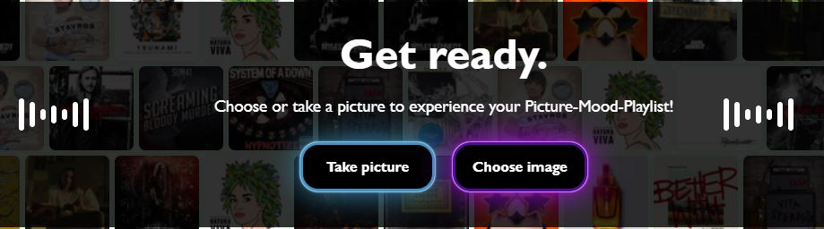
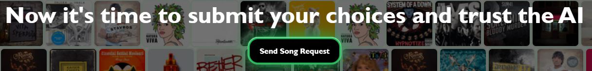
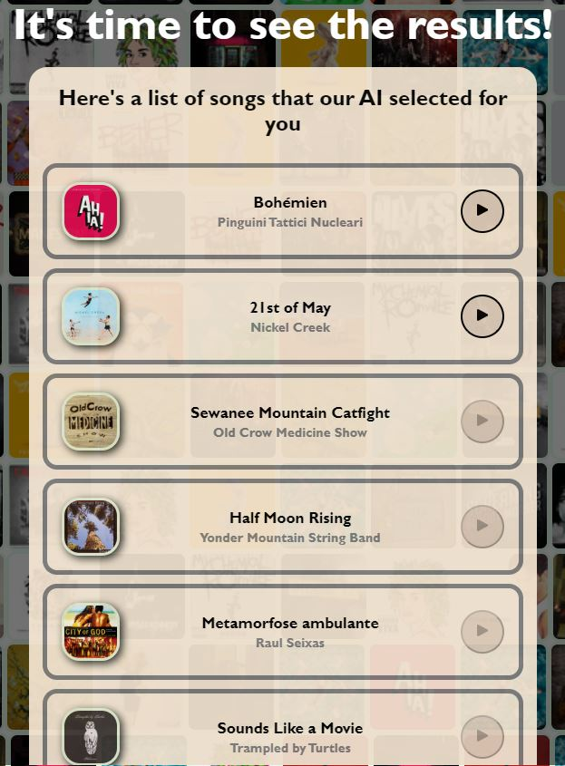

# Picture-Mood-Playlist 

Have you ever thought that for some moments in your life you needed the right soundtrack?
This is the app for you!
You can provide us with a picture that represents your mood and we will create a Spotify playlist inspired by your image that conveys the same mood as the image.

## Introduction

This is the project for the CPAC course, we are Filippo, Jiayan and Haokun (Group7). We created a program that allows users to upload a local photo, or take a photo, then analyze it to return the user's favorite songs in their Spotify account.


<a name="readme-top"></a>

[![Contributors][contributors-shield]][contributors-url]
<!-- [![Forks][forks-shield]][forks-url]
[![Stargazers][stars-shield]][stars-url] -->


<!-- PROJECT LOGO -->
<br />
<div align="center">
  <a href="https://github.com/fillipp97/Picture-Mood-Playlist-CPAC/">
    
  </a>

<h3 align="center">Picture-Mood-Playlist</h3>

  <p align="center">
    You take a picture, we provide you a coherent playlist
    <br />
    <a href="https://github.com/fillipp97/Picture-Mood-Playlist-CPAC/"><strong> Code »</strong></a>
    <br />
    <br />
  </p>
</div>


<!-- TABLE OF CONTENTS -->
<details>
  <summary>Table of Contents</summary>
  <ol>
    <li>
      <a href="#about-the-project">About The Project</a>
      <ul>
        <li><a href="#built-with">Built With</a></li>
      </ul>
    </li>
    <li>
      <a href="#getting-started">Getting Started</a>
      <ul>
        <li><a href="#prerequisites">Prerequisites</a></li>
        <li><a href="#installation">Installation</a></li>
        <li><a href="#startup">Startup</a></li>
      </ul>
    </li>
    <li><a href="#lets-get-groovy">Description</a></li>
    <ul>
        <li><a href="#bpm">Step1</a></li>
        <li><a href="#measure">Step2</a></li>
        <li><a href="#apm">Step3</a></li>   
    </ul>
    <li><a href="#implementation">Implementation</a></li>
    <ul>
        <li><a href="#front-end">Front-end</a></li>
        <li><a href="#back-end">Back-end</a></li>
    </ul>
    <li><a href="#contacts">Contacts</a></li>
  </ol>
</details>


***
<!-- ABOUT THE PROJECT -->
## About The Project


**Picture Mood Playlist** is an entertainment application that allows you to generate a Spotify playlist based on the mood of an input picture.



<p align="right">(<a href="#readme-top">back to top</a>)</p>


### Built With

* [![React][React.js]][React-url]
* [![Flask][Flask.com]][Flask-url]

<p align="right">(<a href="#readme-top">back to top</a>)</p>


***
<!-- GETTING STARTED -->
## Getting Started

Follow the steps below to download, setup and run the app locally.

### Prerequisites

Before running, you will need the following:
* Node.js
  ```sh
   https://nodejs.org/en/download/
  ```

* python 3.x (3.7 or **above** recommended)
    ```sh
    https://www.python.org/downloads/
    ```

### Installation

1. Clone the repo
   ```sh
   git clone https://github.com/armandoboemio/i-am-groove.git
   ```
3. Install NPM packages
   ```sh
   cd client
   npm i
   ```
4. Install python libraries
   ```sh
   cd server
   pip install -r requirements.txt
   ```

### Startup

1. Run Flask
   ```sh
   cd server
   flask run
   ```
2. Run NPM
   ```sh
   cd client
   npm start
   ```

<p align="right">(<a href="#readme-top">back to top</a>)</p>


***
<!-- USAGE EXAMPLES -->
## Description

The user can tweak the parameters to get different rhytmic grooves and patterns.

### Step1


User is asked to upload or take a picture of any kind. After the upload the AI process starts. We can have two situations: 
<ul>
<li> Face is present
<li> Face is not present
</ul>
In the first case the picture is analyzed by Azure's APIs for face emotion detection and a mood is provided. 
In the second case, relying upon Goethe's principles, we linked the color psychology to a mood extracted with low level features, moreover the image is analyzed by an SSD MobileNetv2, a fast network for object detection purposes. All the retrieved information is sent back to the front-end.

### Step2



This step directly follows the previous one. The data we sent before is used in order to presonalize the user experience and to entertain him by asking him questions about his favourite songs and artists. When no face is present in the picture questions related to objects will appear and the chosen objects will be later used for the Playlist Generation purposes.


### Step3



Finally, the answer of the previous questions, after some modifications, are used as a seed to request some recommened songs to the Spotify API.
The returned songs will be filtered according to some rules that will give them scores: the closer the song is to the mood, the higher the score will be.


<p align="right">(<a href="#readme-top">back to top</a>)</p>

***
<!-- IMPLEMENTATION -->
## Implementation

The app has been realized using a *front-end + back-end* approach.


### Front-end
The front-end or <a href="https://github.com/fillipp97/Picture-Mood-Playlist-CPAC/tree/Release/client">client</a> is realized using the React framework. The client is composed by a main and different modules. Each sub-window function is defined as a component. 


<ul>
<li>
The <a href="https://github.com/fillipp97/Picture-Mood-Playlist-CPAC/tree/Release/server/App.js">app component</a> handles the conditional rendering of two children: LoggedIn.js and NotLoggedIn.js most of the GUI elements and state parameters updates are handled by these two components.
</li>
<ul>
<li>
NotLoggedIn.js Handles the Spotify authentication process
</li>
<li>
LoggedIn.js contains all the web app logics and all the interactive steps after the user has logged in
</li>
</ul>
</ul>

### Back-end
The back-end or <a href="https://github.com/fillipp97/Picture-Mood-Playlist-CPAC/tree/Release/server">server</a> is written in python using the micro-framework Flask. Here all the heavy-weight computation is done. In particular, the object recognition and mood recognition tasks are performed in this context. The <a href="https://github.com/fillipp97/Picture-Mood-Playlist-CPAC/tree/Release/server/app.py">API</a> setups the routes to receive and send (<code>GET</code> and <code>POST</code> methods) the commands from the front-end. Secondary files hold the necessary functions for the main code to work. For example Spotify an Musixmatch calls are present.


<p align="right">(<a href="#readme-top">back to top</a>)</p>


***
<!-- CONTACTS -->
## Contacts

Jayan Cui - jiayan.cui@mail.polimi.it

Filippo Gualtieri - filippo.gualtieri@mail.polimi.it

Haokun Song - name@mail.polimi.it


<p align="right">(<a href="#readme-top">back to top</a>)</p>


<!-- MARKDOWN LINKS & IMAGES -->
<!-- https://www.markdownguide.org/basic-syntax/#reference-style-links -->
[contributors-shield]: https://img.shields.io/github/contributors/armandoboemio/i-am-groove.svg?style=for-the-badge
[contributors-url]: https://github.com/fillipp97/Picture-Mood-Playlist-CPAC/graphs/contributors

[forks-shield]: https://img.shields.io/github/forks/fillipp97/Picture-Mood-Playlist-CPAC.svg?style=for-the-badge
[forks-url]: https://github.com/fillipp97/Picture-Mood-Playlist-CPAC/network/members

[stars-shield]: https://img.shields.io/github/stars/fillipp97/Picture-Mood-Playlist-CPAC.svg?style=for-the-badge
[stars-url]: https://github.com/fillipp97/Picture-Mood-Playlist-CPAC/stargazers

[React.js]: https://img.shields.io/badge/React-20232A?style=for-the-badge&logo=react&logoColor=61DAFB
[React-url]: https://reactjs.org/
[Flask.com]: https://img.shields.io/badge/Flask-grey?style=for-the-badge&logo=flask&logoColor=white
[Flask-url]: https://flask.palletsprojects.com/en/2.2.x/
[Main-screen]: images/mainscreen.png
